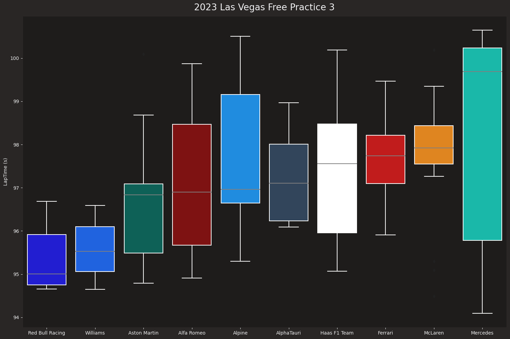

# Project - CS 625, Fall 2023

Nikhil Kumar Bhavani  
Due: December 11, 2023

## Introduction
Las Vegas Grand Prix that took place during November 17, 2023 to November 19, 2023, happened to be the most exciting Grand Prix of the year with all the overtaking that took place during the race. Many teams were looking forward to win the race with all the potential they showed during the three Free Practice Sessions and Qualifying Session. 

## Data
I used an API called [FastF1](https://docs.fastf1.dev/index.html) that helped me get all the data for lap time and tyre compound used for the race.

## Final Questions
* What was the fastest car on track?
* Which team had the best strategy?

## Free Practice 1
The main purpose of Free Practice sessions is to let drivers to get practice on the track and to gather as much data about the car as possible. FP1 on Las Vegas GP ended in 10 minutes after it started due to safety issues on track. So there is not really any importance from the data gathered during this session.

## Free Practice 2
I have found out the lap times drivers were logging vs the tire compound used by drivers.

I used a scatterplot as it would help me understand which type of tires were logging in better times and if I could identify them. From the scatterplot we can observe that cars with soft tires were loggin the fastest times than the other two compounds of tires.

Box plot of the race pace of teams could help me understand how fast each team was performing during the Session.

The box plot show that Ferrari had the fastes car and the rest of the teams were logging times that were very close to each other.

## Free Practice 3

The scatterplot shows that the difference between the fastest lap made by soft tire and the fastest lap recorded by medium tires was 2 seconds.

we can observe that Mercedes were having the fastest car in the session but were having a wide distribtion in lap times. While the rest of the teams were struggling to have good pace, Red Bull Racing and Williams were setting competetive timing, but couldnt close the gap to Mercedes.

## Qualifying
This part of the race sets the starting position of each drivers based on the fastest lap time they log while the fastest being the first in the grid and the least fastest being last in the grid. 

As the softest tires were setting the fastest laps all the teams decided to use them for their tires. 

But the fastest car on track was the Ferrari followed by Red Bull Racing, whcih can be observed by the boxplot.

## Race
All the teams used various types of tires during the race. 

From the boxplot below shows the team pace of each team during the race.

## Links
* Google Colab notebook: https://colab.research.google.com/drive/1HW18O5zU0Xl4ZOvtplDbJ4D4zRaUiACP?usp=sharing

## Idiom/Mark/Data/Encode Table
* Idiom: Scatterplot / Mark: Points

| Data: Attribute | Data: Attribute Type  | Encode: Channel | 
| --- |---| --- |
| Lap Time | Value, Telemetry | vertical position on a common scale (y-axis) |
| Lap Number | Value, Quantitative | horizontal spatial region (x-axis) |

* Idiom: Boxplot / Mark: Box

| Data: Attribute | Data: Attribute Type  | Encode: Channel | 
| --- |---| --- |
| Lap Time | Value, Telemetry | vertical position on a common scale (y-axis) |
| Team | Key, Categorical | horizontal spatial region (x-axis) |

## Results
* From the boxplot in the race we can see that Mclaren had the fastest car during the race, but the Red Bull and the Ferrari have been very competetive based on the distribution of lap times they were setting.
* I believe that Red Bull Racing were having a better strategy compared to the rest of the teams as they performed very well in the race and did a very good job in securing the first place, even though Ferrari were having a lot of advantages throughout the race but were lacking a good strategy that would've helped them secure their win this Season.

## Final Thoughts
There are a lot of factors which contribute for an F1 car to be fast, while I only look at the tire compound used, many other factors such as the temperature of track, use of slipstream by drivers, etc., can also be explored.

## References
* [FastF1](https://docs.fastf1.dev/index.html)
